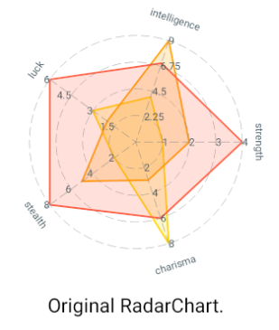
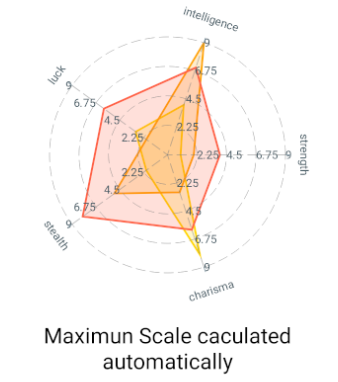
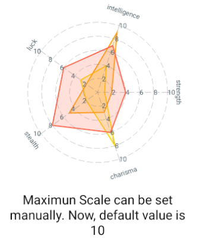

<p align="center">
    
    
    
</p>
## RadarChart Example

## Usage

Install the project dependencies.

```sh
npm install
```

Launch Android

```sh
npm run android
```

Launch iOS
```ios
npm run ios
```

## Used Library
    - victory-native
